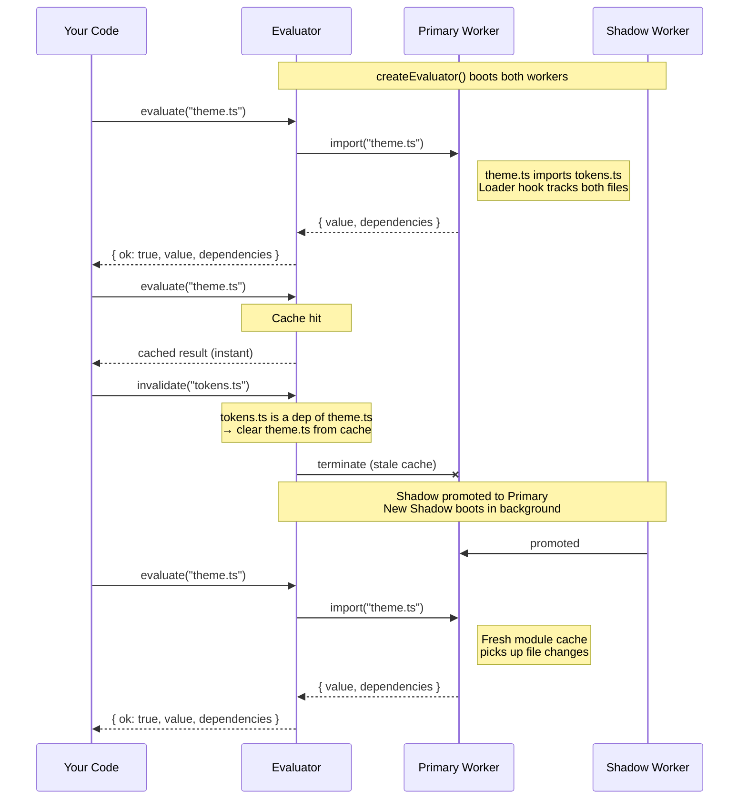
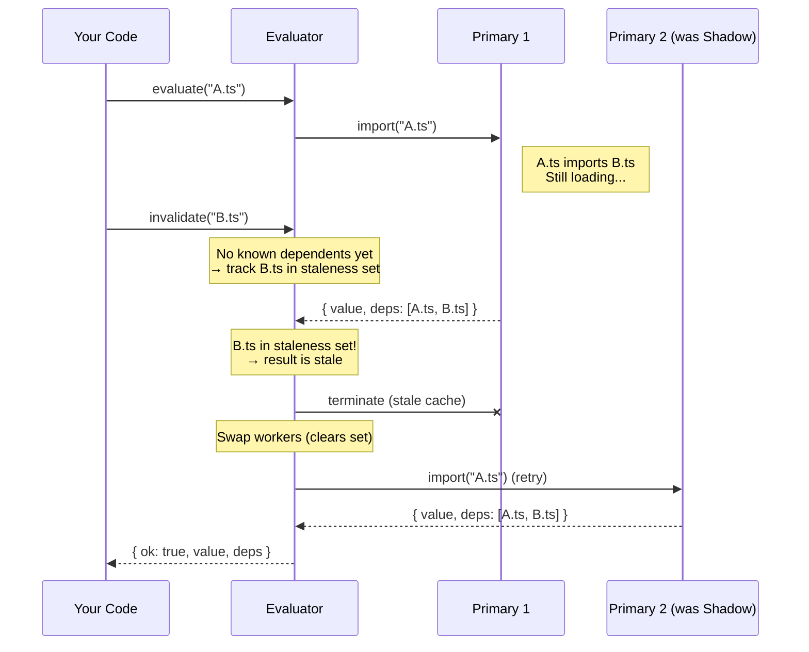

# isolated-source-eval

> Internal module of next-yak. Not published as a standalone package.

Evaluate TypeScript and JavaScript modules in isolated worker threads. Get back serializable exports and a full transitive dependency list — used by the Vite plugin to evaluate user code at build time without polluting the host process.

```ts
import { createEvaluator } from "./isolated-source-eval/index.ts";

const evaluator = await createEvaluator();

const result = await evaluator.evaluate("/absolute/path/to/theme.ts");

if (result.ok) {
  result.value;        // { default: ..., namedExport: ... }
  result.dependencies; // ["/absolute/path/to/theme.ts", "/absolute/path/to/tokens.ts"]
} else {
  result.error;        // { message: string, stack: string }
}
```

## How it works



### Invalidation flows

There are two invalidation scenarios depending on whether the dependency graph is populated:

**Standard invalidation** — the dependency graph knows about the relationship (e.g. A was already evaluated and depends on B). When B is invalidated, the evaluator clears A's cached result, cleans up the dependency graph, swaps workers (terminating the stale primary), and re-queues any in-flight evaluation.

**Cold-start invalidation** — the dependency graph doesn't know about the relationship yet (e.g. `evaluate("A")` is dispatched, then `invalidate("B")` is called before A finishes, but A depends on B). In this case, `invalidate()` tracks B in an internal set. When A's evaluation completes and reports its dependencies, `handleResult()` detects that B is in the set, discards the stale result, swaps workers, and retries automatically.



Each evaluator manages two Node.js worker threads — a **primary** that handles evaluations and a **shadow** that sits idle with a clean module cache.

Modules are loaded via native `import()`. A custom ESM loader hook (registered via `module.register()`) intercepts every resolve call to build the dependency tree. Only project source files are tracked — `node_modules` are excluded.

When a file changes, call `invalidate()`. The primary worker (with its stale ESM cache) is terminated, the shadow is promoted instantly, and a new shadow boots in the background. No restart latency.

Node 24+ strips TypeScript types natively, so `.ts` files work without compilation.

## API

### `createEvaluator()`

Creates an evaluator instance. Boots both workers and waits until they're ready.

```ts
const evaluator = await createEvaluator();
```

Supports `await using` for automatic cleanup:

```ts
await using evaluator = await createEvaluator();
```

### `evaluator.evaluate(absolutePath)`

Evaluates a module and returns its exports plus the full transitive dependency list. Results are cached — subsequent calls with the same path return instantly until invalidated.

```ts
const result = await evaluator.evaluate("/project/src/theme.ts");
```

Returns a discriminated union:

```ts
type EvaluateResult =
  | { ok: true; value: Record<string, unknown>; dependencies: string[] }
  | { ok: false; error: { message: string; stack: string } };
```

Concurrent calls are queued and executed one at a time to keep dependency tracking accurate.

### `evaluator.invalidate(absolutePath)`

Clears cached results for every entry point that transitively depends on the given file, then swaps workers to ensure a clean module cache. If an evaluation is in-flight, it's transparently retried on the fresh worker.

```ts
evaluator.invalidate("/project/src/tokens.ts");
```

Silent no-op if the path isn't in any tracked dependency set.

### `evaluator.invalidateAll()`

Clears the entire result cache and swaps workers.

```ts
evaluator.invalidateAll();
```

### `evaluator.getDependentsOf(absolutePath)`

Returns the entry point paths that would be affected by `invalidate(absolutePath)`. Useful for debugging dependency tracking.

```ts
evaluator.getDependentsOf("/project/src/tokens.ts");
// ["/project/src/theme.ts", "/project/src/dark-theme.ts"]
```

### `evaluator.dispose()`

Terminates both workers and rejects any pending evaluations. Also implemented as `Symbol.asyncDispose`.

```ts
await evaluator.dispose();
```

## Constraints

| Constraint | Detail |
|---|---|
| Node 24+ | Required for stable type stripping. |
| Serializable exports only | Uses `postMessage` (structured clone). Functions, Symbols, WeakMaps, and class instances will produce an `{ ok: false }` error. Export plain data instead. |
| No sandboxing | Evaluated code runs with full Node.js privileges. This is designed for trusted project source files. |
| No file watching | This package does not watch the filesystem. Consumers are responsible for calling `invalidate()` when files change. |
| Type stripping only | TypeScript enums, namespaces, and parameter properties are not supported — only type annotations are stripped. |
| Error caching | Evaluation errors (syntax errors, non-serializable exports) are cached like successes. Call `invalidate()` after fixing the source file to clear the cached error and allow a retry. |

## License

MIT
